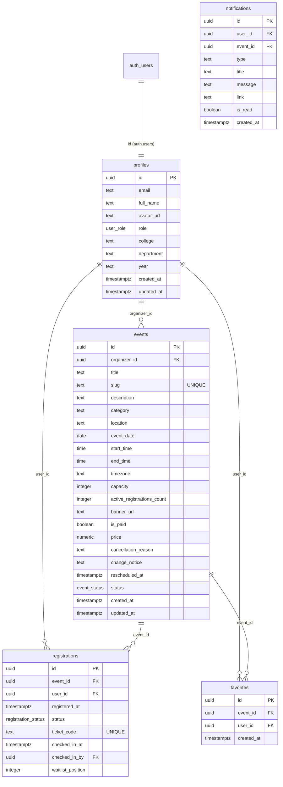

# Database Schema

CampusLoop uses PostgreSQL via Supabase.

## ER Diagram

## Enums & Scoped Roles

- **`user_role`**: `student`, `organizer`
- **`event_status`**: `draft`, `published`, `cancelled`, `completed`
- **`registration_status`**: `registered`, `waitlisted`, `cancelled`, `checked_in`
- **`event_team_role`**: `owner`, `editor`, `check_in_staff`, `viewer`
- **`notification_type`**: `registration_confirmed`, `event_cancelled`, `event_rescheduled`, `venue_changed`, `reminder`, `waitlist_promoted`, `checked_in`, `announcement`

## Phase 6 Tables

### Event Team Members (`event_team_members`)
- `id`: UUID (PK)
- `event_id`: UUID (FK events)
- `user_id`: UUID (FK auth.users)
- `role`: TEXT (`owner`, `editor`, `check_in_staff`, `viewer`)
- `invited_by`: UUID (FK auth.users)
- `created_at`, `updated_at`: TIMESTAMPTZ

### Event Registration Questions (`event_registration_questions`)
- `id`: UUID (PK)
- `event_id`: UUID (FK events)
- `question_text`: TEXT
- `question_type`: TEXT (`text`, `select`, `checkbox`, `textarea`)
- `options`: JSONB (for select dropdown options)
- `is_required`: BOOLEAN
- `sort_order`: INTEGER
- `created_at`, `updated_at`: TIMESTAMPTZ

### Registration Answers (`registration_answers`)
- `id`: UUID (PK)
- `registration_id`: UUID (FK registrations)
- `question_id`: UUID (FK event_registration_questions)
- `answer_text`: TEXT
- `created_at`: TIMESTAMPTZ

### Event Announcements (`event_announcements`)
- `id`: UUID (PK)
- `event_id`: UUID (FK events)
- `sent_by`: UUID (FK auth.users)
- `title`: TEXT
- `message`: TEXT
- `target_filter`: TEXT (`all`, `registered`, `checked_in`, `waitlisted`)
- `recipient_count`: INTEGER
- `created_at`: TIMESTAMPTZ

## Phase 7 Columns & Views

### Extended `events` Columns (Student Decision-Making)
- `agenda`: JSONB (Array of `{ time: string, title: string, description?: string }`)
- `speakers`: JSONB (Array of `{ name: string, role?: string, bio?: string, avatar_url?: string }`)
- `eligibility`: TEXT (Attendee guidelines / qualification requirements)
- `registration_deadline`: TIMESTAMPTZ (Cutoff timestamp after which registration closes)
- `what_to_bring`: TEXT (Checklist of required/recommended materials)
- `contact_method`: TEXT (Public organizer contact method e.g. email/discord)
- `accessibility_notes`: TEXT (Venue accessibility notes and accommodations)
- `map_url`: TEXT (Campus directions or Google Maps URL)

### Extended `profiles` Columns (Club/Organizer Presence & Privacy)
- `bio`: TEXT (Club mission or organizer bio)
- `website_url`: TEXT (Official website link)
- `instagram_handle`: TEXT (Social media handle)
- `contact_email`: TEXT (Public student inquiry email)
- `show_college`: BOOLEAN (Opt-in flag to display college publicly, default false)
- `show_department`: BOOLEAN (Opt-in flag to display department publicly, default false)
- `show_email`: BOOLEAN (Opt-in flag to display contact email publicly, default false)

### Safe Public View `organizer_profiles`
Exposes safe public fields for verified clubs and organizers (`role = 'organizer' AND is_verified = true`):
- `id, full_name, avatar_url, is_verified, campus_id, bio, website_url, instagram_handle`
- `contact_email`: Exposed only when `show_email = true`, else NULL. Personal account `email` is never exposed.
- `college`: Exposed only when `show_college = true`, else NULL.
- `department`: Exposed only when `show_department = true`, else NULL.

## Row Level Security (RLS)

All tables have Row Level Security enabled.

### Profiles
- **SELECT**: Viewable by anyone (true).
- **UPDATE**: Users can only update their own profile (`auth.uid() = id`).
- **INSERT**: Handled by a security definer trigger upon `auth.users` insertion.

### Notifications (Hardened Phase 9B)
- **SELECT**: Users can only read their own notifications (`auth.uid() = user_id`).
- **INSERT**: Least-privilege policy allowing only `service_role`, user self-notifications for legitimate transaction confirmations (`registration_confirmed`, `checked_in`), or authorized event staff (owner/editor) for attendees of their events. Forging notifications for other users is strictly rejected.
- **UPDATE**: Users can update read status (`is_read`) of their own notifications.

### Event Registration Questions (Hardened Phase 9B)
- **SELECT**: Prospective attendees can view questions for `published` events. Questions for draft or unpublished events are restricted to the event organizer and team staff.
- **INSERT/UPDATE/DELETE**: Restricted to event owners and editors.

### Events
- **SELECT**: Anyone can view `published` events. Organizers can view their own events regardless of status.
- **INSERT**: Only users with the `organizer` role can create events, and `organizer_id` must match their `auth.uid()`.
- **UPDATE**: Organizers and event team editors/owners can update events.
- **DELETE**: Only event owners can delete events (and only if 0 attendees).

### Event Team Members
- **SELECT**: Viewable by event owners and assigned team members.
- **INSERT/UPDATE/DELETE**: Managed by event owners.

### Registration Answers
- **INSERT/SELECT**: Attendees can insert and view their own answers.
- **SELECT**: Authorized event staff (owner, editor, viewer) can read answers for their events. Check-in staff are excluded to maintain attendee data minimization.

### Security Definer Functions & Least-Privilege Grants
- Internal helpers (`sync_event_active_registrations`, `check_event_deletion_safety`, `resequence_event_waitlist`, `handle_new_user`, `enforce_event_campus_inheritance`) have `EXECUTE` revoked from `public, anon, authenticated`.
- `check_in_attendee` and `promote_next_waitlisted_attendee` verify caller authorization (`e.organizer_id = auth.uid()` or role in `owner, editor, check_in_staff`) before executing mutations, with `EXECUTE` revoked from `public, anon` and `search_path = public` pinned.

## Phase 9C: Event-Team Permissions & Campus Identity Lifecycle

### Campus Verification Fields on `profiles`
- `campus_verification_status`: TEXT (`unverified`, `pending`, `verified`, `exception`).
  - Automatic `verified` state assigned when email domain matches active campus and `email_confirmed_at` is set.
  - Changes to a different campus require admin review (`pending`) unless matching institutional domain with confirmed email.
- `campus_exception_reason`: TEXT (Reason provided when requesting a cross-campus exception).
- `campus_verified_at`: TIMESTAMPTZ (Timestamp of verification).
- `pending_campus_id`: UUID (Target campus awaiting administrative exception approval).

### Event Campus Immutability
- Trigger `enforce_event_campus_inheritance` prevents modifying `campus_id` on existing events during `UPDATE` operations to prevent events from silently moving between campuses.

### Unified Event Role Permissions Matrix

| Permission | Owner | Editor | Check-in Staff | Viewer | Non-member |
| :--- | :---: | :---: | :---: | :---: | :---: |
| **Edit Event Details** | Yes | Yes | No | No | No |
| **Manage Team Roles** | Yes | No | No | No | No |
| **Manage Custom Questions** | Yes | Yes | No | No | No |
| **Send Announcements** | Yes | Yes | No | No | No |
| **Check-in Attendees (RPC/Scanner)** | Yes | Yes | Yes | No | No |
| **View Participants List** | Yes | Yes | Yes | Yes | No |
| **Export Safe CSV** | Yes | Yes | No | Yes | No |
| **View Registration Custom Answers** | Yes | Yes | No | Yes | No |
| **View Attendance Analytics** | Yes | Yes | No | Yes | No |
| **Cancel Event** | Yes | No | No | No | No |
| **Delete Event (if 0 attendees)** | Yes | No | No | No | No |

## Phase 10: Post-Registration Experience, Delivery Tracking & Moderation

### User Notification Preferences (`user_notification_preferences`)
- `user_id`: UUID (PK, FK auth.users)
- `reminder_24h`: BOOLEAN (default true)
- `reminder_1h`: BOOLEAN (default true)
- `event_updates`: BOOLEAN (default true) - covers reschedule, venue change, cancellation
- `waitlist_promotions`: BOOLEAN (default true)
- `marketing_announcements`: BOOLEAN (default false)
- `email_enabled`: BOOLEAN (default true)
- `updated_at`: TIMESTAMPTZ
- **RLS**: Users can only SELECT, INSERT, and UPDATE their own preferences (`auth.uid() = user_id`).

### Notifications Email Delivery Audit
- `email_status`: TEXT (`pending`, `sent`, `skipped_no_provider`, `failed`, `opted_out`).
- `email_recipient`: TEXT (Recipient email).
- `email_provider`: TEXT (Provider name e.g. `resend`).
- `email_sent_at`: TIMESTAMPTZ (Dispatch timestamp).
- `email_error`: TEXT (Provider error message if delivery failed).
- `dedup_key`: TEXT (Idempotency key e.g. `reminder_24h_{eventId}_{userId}`).
- Index: `idx_notifications_dedup` on `(user_id, event_id, type, dedup_key)`.

### Scheduled Notification Jobs (`notification_jobs`)
- `id`: UUID (PK)
- `event_id`: UUID (FK events)
- `job_type`: TEXT (`reminder_24h`, `reminder_1h`, `reschedule`, `venue_change`, `cancellation`, `registration_confirmed`, `waitlist_promoted`)
- `scheduled_for`: TIMESTAMPTZ
- `status`: TEXT (`pending`, `processing`, `completed`, `failed`, `cancelled`)
- `recipients_count`: INTEGER
- `emails_sent_count`: INTEGER
- `emails_skipped_count`: INTEGER
- `error`: TEXT

### Event Feedback (`event_feedback`)
- `id`: UUID (PK)
- `event_id`: UUID (FK events)
- `user_id`: UUID (FK auth.users)
- `rating`: INTEGER (1 to 5)
- `feedback`: TEXT (Optional comments)
- `has_issue`: BOOLEAN (default false)
- `issue_category`: TEXT (`venue`, `organization`, `safety`, `audio_visual`, `scheduling`, `other`)
- `issue_description`: TEXT
- `created_at`, `updated_at`: TIMESTAMPTZ
- **RLS**: Attendees can only SELECT, INSERT, or UPDATE their own feedback (`auth.uid() = user_id`).
- **Privacy Guarantee**: Organizers cannot query `event_feedback` rows directly. They access aggregate data only through `get_event_feedback_aggregate(p_event_id)` which returns averages, star distributions, and anonymized comments with zero attendee IDs.

### Moderation Reports (`moderation_reports`)
- `id`: UUID (PK)
- `reporter_id`: UUID (FK auth.users)
- `target_type`: TEXT (`event`, `organizer`)
- `target_id`: UUID
- `reason`: TEXT (`spam`, `misleading`, `safety_concern`, `fraud`, `inappropriate`, `harassment`, `other`)
- `details`: TEXT
- `status`: TEXT (`pending`, `investigating`, `action_taken`, `dismissed`)
- `admin_notes`: TEXT
- `reviewed_by`: UUID (FK auth.users)
- `reviewed_at`: TIMESTAMPTZ
- **RLS**: Users can insert and view their own reports. Admins can view and update all reports.

